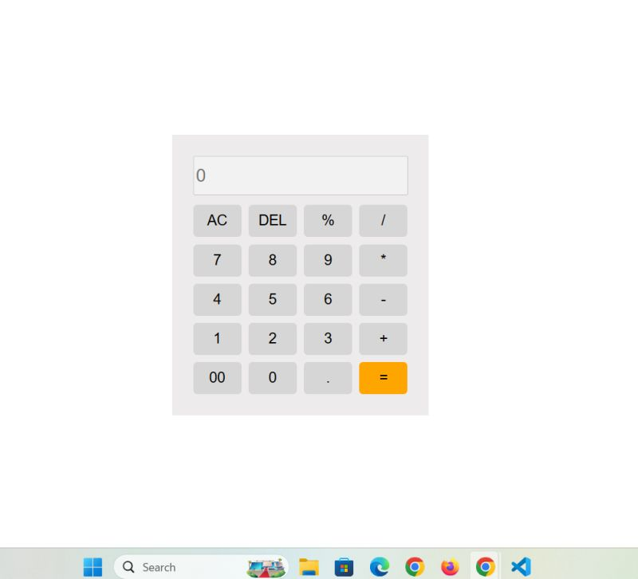

# Calculator

A simple and responsive calculator built using **HTML, CSS, and JavaScript**.  
It can perform basic arithmetic operations like addition, subtraction, multiplication, and division.

## Features
- Basic operations: `+`, `-`, `*`, `/`
- Percentage (`%`)
- Clear all (AC) and delete (DEL) functions
- Supports decimal numbers
- "00" button for quick entry
- User-friendly and responsive design

## Built With
- HTML
- CSS
- JavaScript

## How to Run
1. Clone the repository:
   ```bash
   git clone https://github.com/birat-patel/Calculator.git
   
2. Open `index.html` in your browser.

## View Live Project
[View Calculator](https://birat-patel.github.io/Calculator/)

## Screenshot


## Author
Birat Kumar

